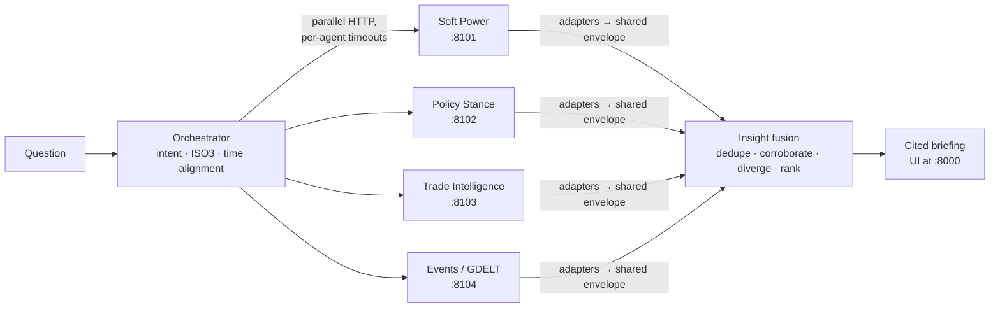

# AI-Driven Global Policy Intelligence System

Team 128 · PES University capstone · guide Dr. Prajwala T. M.

Four analytical agents each model one dimension of state behaviour. An
orchestration layer takes a question in plain English, fans it out to the
agents that can answer it, aligns their answers on one country key and one
time frame, and fuses them into a single cited briefing. The fusion step
flags where the agents **disagree**, because that disagreement is the
project's central claim.



| Agent | Owner | Data | Answers |
|---|---|---|---|
| Soft Power Index | Anushree | 10 open datasets → 23 KPIs, PCA weights, Kalman smoothing | influence level, trend, 5-year forecast, drivers, peers |
| Policy Stance | Santhosh | UN GA voting (1989-2025), UCDP conflict data | UN-voting blocs, conflict record, diplomatic partners, pairwise alignment |
| Trade Intelligence | Takshak | CEPII BACI HS92, 1995-2024 | structural risk, trading blocs, leverage, sector fragility, shock propagation, forecasts |
| Event Summarization | Shreyas | GDELT V1 daily events, GGE 1990-2024 | today's activity, tone and counterparts vs the long-run baseline |

## Quick start (Windows)

```powershell
scripts\setup_local.ps1      # once: .venv with every service's dependencies
scripts\run_all.ps1          # start all five services and wait until healthy
```

Open **http://127.0.0.1:8000** and ask, for example, *How exposed is India
right now?*. Stop everything with `scripts\stop_all.ps1`.

On macOS or Linux use `scripts/run_all.sh` (and `scripts/run_all.sh stop`).
With Docker: `docker compose up --build`.

Data is not committed. **docs/DATA.md** lists what each service needs and
where to get it. Any agent without its data still starts, and the briefing
says what is missing.

Each module's own dashboard still works. `scripts\run_dashboards.ps1` starts
all four, pointed at the platform ports, which is what the "Open module
dashboard" links in the briefing UI expect. See the list below.

| Service | API | Own dashboard |
|---|---|---|
| Orchestrator + briefing UI | :8000 | http://127.0.0.1:8000 |
| Soft Power | :8101 | http://localhost:5174 |
| Policy Stance | :8102 | http://localhost:5175 |
| Trade | :8103 | http://localhost:8080/?api=http://127.0.0.1:8103 |
| Events | :8104 | http://localhost:5176 |

## What a question goes through

1. **Parse** (`orchestrator/app/intent.py`). The question becomes an intent:
   country profile, bilateral, shock, forecast, blocs, events, or ranking.
   The parser also extracts countries (as ISO3), a time window, sector,
   shock severity, and the agents to ask with a reason for each. `POST /parse`
   shows the plan without running it.
2. **Align time.** For "latest" questions the annual agents are asked for the
   newest year they can *all* serve (currently 2024). Events uses the latest
   published GDELT day and compares it with the GGE annual baseline.
3. **Fan out.** Agents are called in parallel. A down, slow or still-loading
   agent gets a status, and the briefing is built from the rest.
4. **Normalise.** One adapter per agent (`orchestrator/app/agents/`) converts
   native responses to the shared envelope, keyed on ISO3, with a confidence
   and reason on every claim.
5. **Fuse** (`orchestrator/app/fusion.py`). Dedupe, then cross-check
   independent agents. Examples: trade bloc vs UN bloc, critical trade partner
   vs diplomatic camp, soft-power momentum vs trade forecast, today's news vs
   trade stakes and the historical baseline. Each check is marked as a
   corroboration or a divergence, then everything is ranked by confidence.
6. **Brief** (`orchestrator/app/briefing.py`). A headline, a summary, and
   sections in which every sentence cites the agent(s) and confidence behind
   it.

## Repository layout

```
orchestrator/            the integration layer (new): FastAPI app, adapters, fusion, UI, tests
services/soft_power/     Anushree's module, vendored at the commit in modules.lock.json
services/policy_stance/  Santhosh's module
services/trade_intelligence/  Takshak's module
services/event_summarization/ Shreyas's module
patches/                 the integration fixes applied on top of each module (reviewable diffs)
deploy/                  Dockerfiles for the platform images
docs/                    INTEGRATION_PLAN, CONTRACT, MODULE_NOTES, DATA
scripts/                 setup, run/stop, smoke test, module sync
```

Each module stays runnable on its own, with its own dashboard, exactly as its
owner built it. **docs/MODULE_NOTES.md** lists every change made for
integration and why. To take an owner's newer commit:

```bash
python scripts/sync_modules.py pull policy_stance      # re-vendor and re-apply the patch
python scripts/sync_modules.py status                  # what differs from upstream
```

## Tests

```bash
cd orchestrator && ../.venv/Scripts/python -m pytest          # orchestrator: parser, crosswalk, fusion, adapters, API
python scripts/smoke_test.py                                  # end-to-end against running services
```

Adapter and API tests replay agent responses recorded from the live services
(`orchestrator/tests/fixtures/`), so they need no data and no running
services.

## Documentation

- [docs/INTEGRATION_PLAN.md](docs/INTEGRATION_PLAN.md): options considered and the decisions taken
- [docs/CONTRACT.md](docs/CONTRACT.md): the envelope, facets, confidence rules, orchestrator API
- [docs/MODULE_NOTES.md](docs/MODULE_NOTES.md): what integration found in each module
- [docs/DATA.md](docs/DATA.md): datasets, sources, sizes
