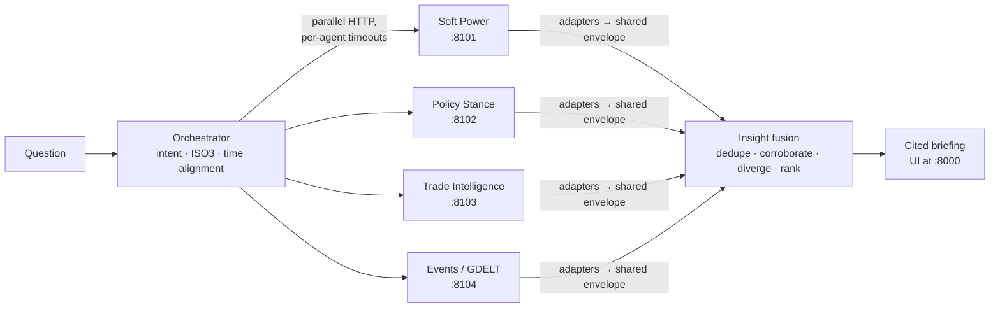

# AI-Driven Global Policy Intelligence System

Team 128 · PES University capstone · guide Dr. Prajwala T. M.

Four analytical agents each model one dimension of state behaviour. An
orchestration layer takes a question in plain English, fans it out to the
agents that can answer it, aligns their answers on one country key and one
time frame, and fuses them into a single cited briefing. The fusion step
flags where the agents **disagree**, because that disagreement is the
project's central claim.



| Agent | Owner | Data | Answers |
|---|---|---|---|
| Soft Power Index | Anushree | 10 open datasets → 23 KPIs, PCA weights, Kalman smoothing, XGBoost | influence level, trend, 5-year Kalman forecast, SHAP drivers, peer comparison |
| Policy Stance | Santhosh | UN GA voting 544,453 votes / 198 countries (1989-2025), UCDP Dyadic + GED + Non-state + One-sided conflict datasets | UN-voting blocs (anchor-similarity + Louvain discovery), conflict exposure, diplomatic partners, pairwise alignment, 5-year conflict forecast |
| Trade Intelligence | Takshak | CEPII BACI HS92, 1995-2024 | structural risk, trading blocs, leverage, sector fragility, shock propagation, forecasts |
| Event Summarization | Shreyas | GDELT V1 daily events, GGE 1990-2024 | today's activity, tone and counterparts vs the long-run baseline; validated themes; domestic vs international split; top events checked against their source articles |

## Quick start (Windows)

```powershell
scripts\setup_local.ps1      # once: .venv with every service's dependencies
scripts\run_all.ps1          # start all five services and wait until healthy
```

Open **http://127.0.0.1:8000** and ask, for example, *How exposed is India
right now?*. Stop everything with `scripts\stop_all.ps1`.

On macOS or Linux use `scripts/run_all.sh` (and `scripts/run_all.sh stop`).
With Docker: `docker compose up --build`.

Large datasets are not committed; the trade agent's 21 MB parquet cache is,
so it answers on a fresh clone. **docs/DATA.md** lists what each service needs and
where to get it. Any agent without its data still starts, and the briefing
says what is missing.

Each module's own dashboard still works. `scripts\run_dashboards.ps1` starts
all four, pointed at the platform ports, which is what the "Open module
dashboard" links in the briefing UI expect. See the list below.

| Service | API | Own dashboard |
|---|---|---|
| Orchestrator + briefing UI | :8000 | http://127.0.0.1:8000 |
| Soft Power | :8101 | http://localhost:5174 |
| Policy Stance | :8102 | http://localhost:5175 |
| Trade | :8103 | http://localhost:8080/?api=http://127.0.0.1:8103 |
| Events | :8104 | http://localhost:5176 |

## What a question goes through

1. **Parse** (`orchestrator/app/intent.py`). The question becomes an intent:
   country profile, bilateral, shock, forecast, blocs, events, or ranking.
   The parser also extracts countries (as ISO3), a time window, sector,
   shock severity, and the agents to ask with a reason for each. `POST /parse`
   shows the plan without running it.
2. **Align time.** For "latest" questions the annual agents are asked for the
   newest year they can *all* serve (currently 2024). Events uses the latest
   published GDELT day and compares it with the GGE annual baseline.
3. **Fan out.** Agents are called in parallel. A down, slow or still-loading
   agent gets a status, and the briefing is built from the rest.
4. **Normalise.** One adapter per agent (`orchestrator/app/agents/`) converts
   native responses to the shared envelope, keyed on ISO3, with a confidence
   and reason on every claim, plus a caveat where a claim needs one. The
   Events adapter also checks each of the day's top events against its source
   article, with no AI model. It flags events the article does not support as
   likely mis-tagged by GDELT, so the briefing does not report them as news.
5. **Fuse** (`orchestrator/app/fusion.py`). Dedupe, then cross-check
   independent agents. Examples: trade bloc vs UN bloc, critical trade partner
   vs diplomatic camp, soft-power momentum vs trade forecast, today's news vs
   trade stakes and the historical baseline. Each check is marked as a
   corroboration or a divergence, then everything is ranked by confidence.
6. **Brief** (`orchestrator/app/briefing.py`). A headline, a summary, and
   sections in which every sentence cites the agent(s) and confidence behind
   it. The UI then shows each agent in the same panel: headline numbers,
   views drawn from the evidence behind its claims, and every claim with its
   confidence and caveat.

## Policy Stance module — what it contributes to the combined briefing

The Policy Stance module (`services/policy_stance/`, port 8102) is Santhosh's
module. It is the only agent that reasons about **geopolitical alignment** from
first principles — not news, not trade flows, but how 198 countries actually
voted in the UN General Assembly across 36 years and what conflicts they were
party to in the UCDP data.

### Data
- **UN GA voting**: 544,453 vote records across 198 countries (1989-2025),
  loaded from the UN Digital Library export. Each resolution carries a topic
  label so the module can surface issue-specific stances.
- **UCDP conflict data** (four datasets combined): Dyadic, GED, Non-state,
  One-sided violence — linked to countries via Gleditsch-Ward codes with a
  202-entry ISO3→GW crosswalk.

### Endpoints the orchestrator uses

| Endpoint | What the combined briefing gets from it |
|---|---|
| `GET /health` | Liveness check; orchestrator marks the agent `ok` or `not_ready` before asking a question |
| `GET /capabilities` | Module self-description pulled into the orchestrator's `/capabilities` route |
| `GET /countries` | GW-code → country-name lookup; the orchestrator uses this to map ISO3 safely across the API boundary |
| `GET /country/{name}` | Full profile — conflict timeline, centrality, top partners, UN vote distribution — powers the `conflict_exposure` and `diplomatic_partners` insights |
| `GET /blocs-by-year/{year}` | Anchor-similarity bloc assignment for a rolling 7-year window; powers `diplomatic_alignment` insights |
| `GET /alliance-blocs` | Full 1989-2025 bloc assignment; fallback when no specific year is requested |
| `GET /bloc-discovery/{year}` | **Louvain community detection** on the vote-similarity network; no anchor countries, no manual overrides — produces a separate `diplomatic_blocs` insight that the fuser compares against the anchor-similarity result |
| `GET /compare-insight` | Bilateral similarity, vote match rate, drift, bloc membership; powers the `bilateral_diplomacy` insight on paired-country questions |
| `GET /forecast` | Linear conflict-trend extrapolation; powers the `conflict_outlook` insight on forecast questions |

### What Louvain discovery adds

`/blocs-by-year` assigns countries by cosine similarity to hand-picked anchor
countries (USA, Russia, China, India, …). `/bloc-discovery` runs Louvain
community detection on the same vote-similarity graph with **no labels at all**
and returns the clusters the data finds. The orchestrator calls both and
generates a `diplomatic_blocs` insight that notes whether the methods **agree**
(higher confidence) or **disagree** (shown as a caveat for the fusion layer to
flag). This is the diplomatic equivalent of the trade-vs-UN divergence the
project highlights — a methodological cross-check inside the Policy Stance
agent itself.

### Facets in the fused briefing

| Facet | Produced by |
|---|---|
| `diplomatic_alignment` | Anchor-similarity bloc assignment; confidence follows provenance (`vote_model`, `anchor`, `manual_override`, `fallback_rule`) |
| `diplomatic_blocs` | Louvain discovery result; cross-checked against `diplomatic_alignment` in fusion |
| `conflict_exposure` | UCDP conflict records and deaths from the timeline (not the graph-node summary) |
| `conflict_outlook` | 5-year linear extrapolation of yearly conflict counts |
| `diplomatic_partners` | Top UN-vote agreement partners from the conflict/agreement graph |
| `bilateral_diplomacy` | Pairwise similarity, vote match rate, temporal drift for country-pair questions |

### Running standalone

```powershell
cd services\policy_stance
..\..\scripts\run_dashboards.ps1   # starts the module on :8102 with its own React dashboard at :5175
```

Or directly:

```powershell
cd services\policy_stance
python -m uvicorn backend.main:app --port 8102 --reload
```

The dashboard is at `http://localhost:5175`. The API is at
`http://localhost:8102` — try `/health`, `/countries`, `/alliance-blocs`, and
`/bloc-discovery/2024`.

## Repository layout

```
orchestrator/            the integration layer (new): FastAPI app, adapters, fusion, UI, tests
services/soft_power/     Anushree's module, vendored at the commit in modules.lock.json
services/policy_stance/  Santhosh's module
services/trade_intelligence/  Takshak's module
services/event_summarization/ Shreyas's module
patches/                 the integration fixes applied on top of each module (reviewable diffs)
deploy/                  Dockerfiles for the platform images
docs/                    INTEGRATION_PLAN, CONTRACT, MODULE_NOTES, DATA
scripts/                 setup, run/stop, smoke test, module sync
```

Each module stays runnable on its own, with its own dashboard, exactly as its
owner built it. **docs/MODULE_NOTES.md** lists every change made for
integration and why. To take an owner's newer commit:

```bash
python scripts/sync_modules.py pull policy_stance      # re-vendor and re-apply the patch
python scripts/sync_modules.py status                  # what differs from upstream
```

## Tests

```bash
cd orchestrator && ../.venv/Scripts/python -m pytest          # orchestrator: parser, crosswalk, fusion, adapters, API
python scripts/smoke_test.py                                  # end-to-end against running services
```

Adapter and API tests replay agent responses recorded from the live services
(`orchestrator/tests/fixtures/`), so they need no data and no running
services.

## Documentation

- [docs/INTEGRATION_PLAN.md](docs/INTEGRATION_PLAN.md): options considered and the decisions taken
- [docs/CONTRACT.md](docs/CONTRACT.md): the envelope, facets, confidence rules, orchestrator API
- [docs/MODULE_NOTES.md](docs/MODULE_NOTES.md): what integration found in each module
- [docs/DATA.md](docs/DATA.md): datasets, sources, sizes
